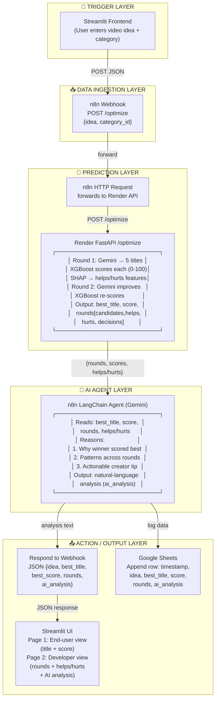

# Architecture Diagram — YouTube Title Optimizer (Agentic AI)

## Mermaid (render at mermaid.live or in VS Code)



## Data Flow Summary

```
USER (Streamlit)
  │  idea: "how to cook steak", category_id: 24
  ▼
🔔 TRIGGER LAYER
  │  n8n Webhook POST /optimize
  ▼
📥 DATA INGESTION LAYER
  │  Validate & forward {idea, category_id}
  ▼
🧠 PREDICTION LAYER
  │  Render /optimize
  │  ├─ Round 1: Gemini → 5 titles → XGBoost scores each
  │  │   └─ SHAP feature contributions → helps[] / hurts[]
  │  └─ Round 2: Gemini improves top 2 → XGBoost re-scores
  │  Output: best_title, best_score (0-100), rounds[]
  ▼
🤖 AI AGENT LAYER
  │  n8n LangChain Agent (Gemini)
  │  Reads: rounds, scores, helps/hurts
  │  Reasons: why winner won, patterns, tips
  │  Output: ai_analysis (natural language)
  ▼
📤 ACTION / OUTPUT LAYER
  ├─ Respond to Webhook → JSON → Streamlit (2-page UI)
  └─ Google Sheets → append row (audit log)
```

## Layer Breakdown

| Layer | Component | Technology | Role |
|-------|-----------|------------|------|
| 🔔 Trigger | Streamlit + n8n Webhook | Python, n8n | User submits idea → workflow starts |
| 📥 Ingestion | n8n HTTP Request | n8n | Validates & forwards to prediction API |
| 🧠 Prediction | Render FastAPI /optimize | FastAPI, XGBoost, Gemini | 2-round iterative title generation + ML scoring + SHAP explainability |
| 🤖 AI Agent | n8n LangChain Agent | LangChain, Gemini | Autonomous reasoning over prediction results |
| 📤 Action/Output | Respond to Webhook + Google Sheets | n8n | Structured JSON response + persistent audit log |
